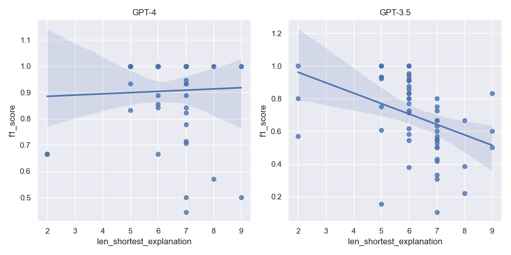

## Results

### Core Results

We ran all non-obfuscated benchmarks through all models and scored the results, 
summarized in @tbl:main-results.

{{main_results}}

Table: Results over all tasks (no obfuscation)
{#tbl:main-results}

These results show that generally GPT-4 improves over GPT-3.5-turbo. They also show
that attempting to elicit an explanation or chain of thought reasoning actually reduces
accuracy, and the best results are found using the `basic` strategy.

### Obfuscation

To test whether the LLM performance was dependent on prior knowledge of the ontologies
used, we performed an additional test with obfuscated ontologies. Here we obfuscated
classes, individuals, and predicates, replacing each with its
base 64 representation. However, we left builtin OWL language constructs
such as SubClassOf intact. These results are show in @tbl:obfuscated-results.

{{obfuscated_results}}

Table: Results on obfuscated ontologies
{#tbl:obfuscated-results}

Obfuscation resulted in drastically reduced performance for GPT-3.5 in the `abox` task.
The decrease is less marked with GPT-4. On other tasks, obfuscation had little effect
on GPT-4, and in some cases performance was slightly improved.

### Effect of chain lengths

We explored the effect of the complexity of the explanation for an inference on performance, using
the transitive reasoning task. This is shown in @fig:complexity-scatter-plot

{#fig:complexity-scatter-plot width=7in height=4in}
Effect of path length on accuracy of transitive reasoning task. The x-axis shows the length of the path,
the y axis is the accuracy (F1).

For GPT-3.5 performance degraded with the size of explanation (length of paths). For GPT-4, performance
remained constant regardless of path length.
