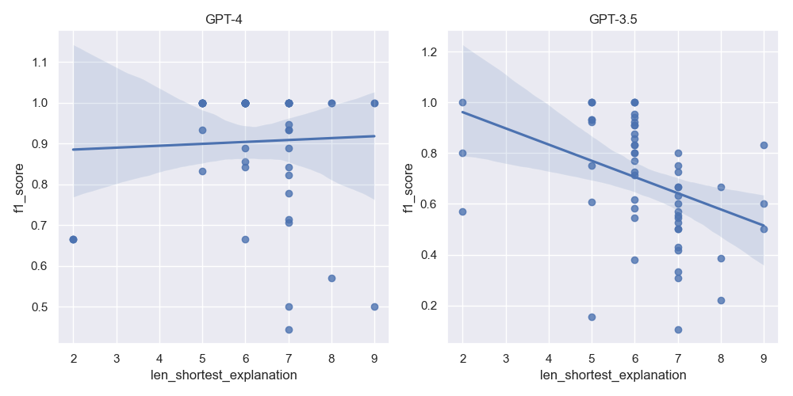

---
title: Evaluation of Large Language Models on ontology reasoning tasks and implications for neurosymbolic approaches
keywords:
- GPT
- Large Language Models
- OWL
- Reasoning
- Ontologies
lang: en-US
date-meta: '2024-04-05'
author-meta:
- Sierra Moxon
- Nico Matentzoglu
- Hyeongsik Kim
- Chris Mungall
header-includes: |
  <!--
  Manubot generated metadata rendered from header-includes-template.html.
  Suggest improvements at https://github.com/manubot/manubot/blob/main/manubot/process/header-includes-template.html
  -->
  <meta name="dc.format" content="text/html" />
  <meta property="og:type" content="article" />
  <meta name="dc.title" content="Evaluation of Large Language Models on ontology reasoning tasks and implications for neurosymbolic approaches" />
  <meta name="citation_title" content="Evaluation of Large Language Models on ontology reasoning tasks and implications for neurosymbolic approaches" />
  <meta property="og:title" content="Evaluation of Large Language Models on ontology reasoning tasks and implications for neurosymbolic approaches" />
  <meta property="twitter:title" content="Evaluation of Large Language Models on ontology reasoning tasks and implications for neurosymbolic approaches" />
  <meta name="dc.date" content="2024-04-05" />
  <meta name="citation_publication_date" content="2024-04-05" />
  <meta property="article:published_time" content="2024-04-05" />
  <meta name="dc.modified" content="2024-04-05T16:55:06+00:00" />
  <meta property="article:modified_time" content="2024-04-05T16:55:06+00:00" />
  <meta name="dc.language" content="en-US" />
  <meta name="citation_language" content="en-US" />
  <meta name="dc.relation.ispartof" content="Manubot" />
  <meta name="dc.publisher" content="Manubot" />
  <meta name="citation_journal_title" content="Manubot" />
  <meta name="citation_technical_report_institution" content="Manubot" />
  <meta name="citation_author" content="Sierra Moxon" />
  <meta name="citation_author_institution" content="Environmental Genomics and Systems Biology Division, Lawrence Berkeley National Laboratory, Berkeley, CA, 94720" />
  <meta name="citation_author_orcid" content="XXXX-XXXX-XXXX-XXXX" />
  <meta name="citation_author" content="Nico Matentzoglu" />
  <meta name="citation_author_orcid" content="XXXX-XXXX-XXXX-XXXX" />
  <meta name="citation_author" content="Hyeongsik Kim" />
  <meta name="citation_author_orcid" content="XXXX-XXXX-XXXX-XXXX" />
  <meta name="citation_author" content="Chris Mungall" />
  <meta name="citation_author_institution" content="Environmental Genomics and Systems Biology Division, Lawrence Berkeley National Laboratory, Berkeley, CA, 94720" />
  <meta name="citation_author_orcid" content="0000-0002-6601-2165" />
  <link rel="canonical" href="https://cmungall.github.io/gpt-reasoning-manuscript/" />
  <meta property="og:url" content="https://cmungall.github.io/gpt-reasoning-manuscript/" />
  <meta property="twitter:url" content="https://cmungall.github.io/gpt-reasoning-manuscript/" />
  <meta name="citation_fulltext_html_url" content="https://cmungall.github.io/gpt-reasoning-manuscript/" />
  <meta name="citation_pdf_url" content="https://cmungall.github.io/gpt-reasoning-manuscript/manuscript.pdf" />
  <link rel="alternate" type="application/pdf" href="https://cmungall.github.io/gpt-reasoning-manuscript/manuscript.pdf" />
  <link rel="alternate" type="text/html" href="https://cmungall.github.io/gpt-reasoning-manuscript/v/52cc8412aaa67f4d86d1594fe98b7c96188225a9/" />
  <meta name="manubot_html_url_versioned" content="https://cmungall.github.io/gpt-reasoning-manuscript/v/52cc8412aaa67f4d86d1594fe98b7c96188225a9/" />
  <meta name="manubot_pdf_url_versioned" content="https://cmungall.github.io/gpt-reasoning-manuscript/v/52cc8412aaa67f4d86d1594fe98b7c96188225a9/manuscript.pdf" />
  <meta property="og:type" content="article" />
  <meta property="twitter:card" content="summary_large_image" />
  <link rel="icon" type="image/png" sizes="192x192" href="https://manubot.org/favicon-192x192.png" />
  <link rel="mask-icon" href="https://manubot.org/safari-pinned-tab.svg" color="#ad1457" />
  <meta name="theme-color" content="#ad1457" />
  <!-- end Manubot generated metadata -->
bibliography:
- content/manual-references.json
manubot-output-bibliography: output/references.json
manubot-output-citekeys: output/citations.tsv
manubot-requests-cache-path: ci/cache/requests-cache
manubot-clear-requests-cache: false
...


<small><em>
This manuscript
([permalink](https://cmungall.github.io/gpt-reasoning-manuscript/v/52cc8412aaa67f4d86d1594fe98b7c96188225a9/))
was automatically generated
from [cmungall/gpt-reasoning-manuscript@52cc841](https://github.com/cmungall/gpt-reasoning-manuscript/tree/52cc8412aaa67f4d86d1594fe98b7c96188225a9)
on April 5, 2024.
</em></small>


## Authors


+ **Sierra Moxon**
  <br>
    {.inline_icon width=16 height=16}
    [XXXX-XXXX-XXXX-XXXX](https://orcid.org/XXXX-XXXX-XXXX-XXXX)
    · {.inline_icon width=16 height=16}
    [sierra-moxon](https://github.com/sierra-moxon)
    <br>
  <small>
     Environmental Genomics and Systems Biology Division, Lawrence Berkeley National Laboratory, Berkeley, CA, 94720
     · Funded by Grant XXXXXXXX
  </small>

+ **Nico Matentzoglu**
  <br>
    {.inline_icon width=16 height=16}
    [XXXX-XXXX-XXXX-XXXX](https://orcid.org/XXXX-XXXX-XXXX-XXXX)
    · {.inline_icon width=16 height=16}
    [matentzn](https://github.com/matentzn)
    <br>
  <small>
  </small>

+ **Hyeongsik Kim**
  <br>
    {.inline_icon width=16 height=16}
    [XXXX-XXXX-XXXX-XXXX](https://orcid.org/XXXX-XXXX-XXXX-XXXX)
    <br>
  <small>
  </small>

+ **Chris Mungall**
  ^[✉](#correspondence)^<br>
    {.inline_icon width=16 height=16}
    [0000-0002-6601-2165](https://orcid.org/0000-0002-6601-2165)
    · {.inline_icon width=16 height=16}
    [cmungall](https://github.com/cmungall)
    <br>
  <small>
     Environmental Genomics and Systems Biology Division, Lawrence Berkeley National Laboratory, Berkeley, CA, 94720
  </small>


::: {#correspondence}
✉ — Correspondence possible via [GitHub Issues](https://github.com/cmungall/gpt-reasoning-manuscript/issues)
or email to
Chris Mungall \<cjmungall@lbl.gov\>.


:::


## Abstract {.page_break_before}

Reasoning is a core component of human intelligence, and a key goal of Artificial Intelligence (AI) research.
Reasoning has traditionally been the domain of symbolic AI, but recent advances in deep learning
and in particular Large Language Models (LLMs) such as GPT-4 indicate that LLMs may have
some latent reasoning ability. This has been investigated in some domains such as mathematical reasoning,
but the ability of LLMs to reason over knowledge representation formalisms such as Description Logics (DL) has not been
systematically tested. Understanding the accuracy of this latent reasoning behavior is important for
designing LLM-based applications, in particular in deciding between single-pass approaches vs hybrid
or multi-agent approaches.

To investigate the latent abilities of LLMs to perform symbolic ontological reasoning, we
created a series of benchmarks covering the EL++ fragment of the Web Ontology Language (OWL).
We also created a GPT-based reasoning agent that uses a few-shot in-context learning approach to reason
over OWL ontologies.

Our results show that for small ontologies and certain simple tasks such as transitive SubClassOf
reasoning, or inferring familial relationships, GPT-4 frequently yields the correct answers to 
benchmark questions, although less than the 100% guaranteed accuracy of a symbolic reasoner. For other
tasks, LLMs performed less well, and in particular LLMs seem fundamentally unable to detect
inconsistencies in even simple small test cases.

Our results indicate that a maximalist single-pass approach to building LLMs knowledge-based applications inherently
leads to lower accuracy, and that a hybrid multi-agent approach combining the best aspects of
language models and symbolic reasoning over knowledge bases should be favored.

Code is available from https://github.com/monarch-initiative/ontogpt, and analysis from TODO zenodo DOI


## Introduction

### Motivation

The field of Artificial Intelligence (AI) has historically been divided into two schools of thought:
symbolic AI and connectionist AI. Symbolic AI is exemplified by ontologies and knowledge bases, which represent
knowledge as a set of symbols together with rules or formal model theories for manipulating those symbols.
Connectionist AI is exemplified by methods derived from statistics and machine learning, in more recently deep learning neural network
architectures. The field of neurosymbolic AI aims to combine the best aspects of both symbolic and connectionist AI,
but currently most approaches fall in one of the two camps.

The most striking recent development in machine learning has been the development of Large Language Models (LLMs),
which show exceptional abilities in tasks such as question-answering and text summarization,
as well as the ability to generalize from a handful of examples (in context or few-shot learning)
[@doi:10.48550/arXiv.2005.14165]. 
The abilities of the latest generation of LLMs such as GPT-4 seem to suggest that LLMs may be able to perform
reasoning tasks that were previously the domain of symbolic AI, in the same way that a human may incorporate
reasoning as a part of natural language question-answering. If LLMs are in fact able to effectively perform symbolic reasoning as part of their normal prompt completion process, this would suggest less of a role for symbolic AI and
explicit rule-based reasoning. If instead LLMs are only able to perform reasoning in a limited set of circumstances,
this would suggest that LLM-based applications should employ hybrid or multi-agent approaches. An example
of this approach is frameworks such as LangChain, or the ChatGPT plugin system which allows interfacing with external Python programs or tools such as Mathematica.

Some previous studies have examined the mathematical reasoning abilities of LLMs, and others have
examined "common-sense" reasoning abilities. Existing datasets for testing reasoning ability include  LogiQA [@doi:10.48550/arXiv.2007.08124] and ReClor [@doi:10.48550/arXiv.2002.04326]. These are aimed at testing reasoning abilities in the
context of natural language understanding. For example, LogiQA contains as instance with paragraph
"_David knows Mr. Zhang's friend Jack, and Jack knows David's friend  Ms. Lin. Everyone of them who knows Jack has a master's degree, and  everyone of them who knows Ms. Lin is from Shanghai._" and question "_Who is from Shanghai and has a masters degree?_".
Liu et al adapted these for evaluation using prompt-based LLMs such as GPT [@doi:10.48550/arXiv.2304.03439].

However, there are no LLM-based benchmarks for testing the kinds of symbolic reasoning abilities
needed for working with ontologies and knowledge bases such as the Gene Ontology (GO) or the
Human Phenotype Ontology (HPO). These abilities are necessary for using ontologies in tasks such
as interpreting high-throughput genomic data or prioritizing variants in genetic diseases. Existing
OWL reasoning benchmarks such as OWL2Bench and LUBM are designed to test the performance at scale rather
than accuracy, since accuracy can generally be proven based on the formal semantics of ontology languages.

Here we describe the creation of a set of benchmarks that can be used to test the reasoning abilities
of LLMs against the commonly used EL++ subset of the Description Logic (DL) language, OWL (Web Ontology Language).
We created a reasoner agent ReasonerGPT that uses an in-context approach to solving reasoning problems, and
we evaluated this against our benchmarks.

### Contributions

We make the following contributions:

- We have curated a collection of benchmarks for testing ontological reasoning ability
- We created a GPT-based reasoning agent that is intended to perform ontological reason using
  a few-shot learning approach, using instruction prompting and in-context examples.
- We have evaluated the reasoning ability of GPT-3.5-turbo and GPT-4 on these benchmarks

## Methods

### Semi-automatic generation of reasoning benchmarks from ontologies

We created a methods to generate 8 classes of benchmarks, summarized in @tbl:tasks

| code       | task                              | description                                                                |
|:-----------|:----------------------------------|:---------------------------------------------------------------------------|
| sat        | OntologyCoherencyTask             | A task to determine if an ontology is coherent.                            |
| indirect   | EntailedIndirectSuperClassTask    | A task to determine the indirect superclasses of a class.                  |
| superc     | EntailedTransitiveSuperClassTask  | A task to determine the all transitive superclasses of a class.            |
| expr       | EntailedSubClassOfExpressionTask  | A task to determine the subclasses of a class expression.                  |
| dir-sup    | EntailedDirectSuperClassTask      | A task to determine the direct superclasses of a class.                    |
| mrca       | MostRecentCommonSubsumerTask      | A task to determine the most specific common ancestors.                    |
| abox       | ABoxTask                          | A task to infer assertions over property chains and transitvity in aboxes. |
| tc         | TaxonConstraintTask               | A task to infer validity of a term for a particular taxon.                 |

Table: Different ontology tasks
{#tbl:tasks}

These are designed to test the kinds of reasoning abilities that are relevant for common knowledge-based
inference tasks. For example, the `mrca` tasks tests the ability to find commonalities using an ontology,
as used in semantic similarity algorithms underpinning phenotype-based variant prioritization. The `abox`
task is useful for link prediction over instance data, the `tc` task tests the ability to check the validity
of predicted gene functional associations, and the `expr` task reflects the ability to perform the kind
of transitive reasoning underpinning gene set enrichment.

For each task, we randomly generate 20 tasks using a fragment of either the Gene Ontology (GO) or the
Family History Knowledge Base (FHK) ontology.

### GPT-based reasoning agent

We created a GPT-based reasoning agent that is intended to perform ontological reason using
a few-shot learning approach, using instruction prompting and in-context examples.

The structure of the prompts used in the agent is as follows:


```
I will provide an ontology as a list of axioms using OWL syntax. I will then ask a question about the ontology.
Answer the question, after performing reasoning over the ontology.
If there are multiple answers, list them all each on a separate line starting with the minus symbol ("-"), like a markdown list.
Here are some examples:

{{ examples }}
--

Here is the actual ontology

{{ ontology }}

Query:

{{ question }}
{{ task_specific_prompt }}    
```


Examples are task specific and can be parameterized by the means in which the LLM
is expected to "show its working". For example, the `expr` task includes examples
such as the following:


```jinja

- P type TransitiveProperty
- E2 SubClassOf P some E
- E SubClassOf B
- B SubClassOf P some A
- C SubClassOf A
- D SubClassOf Q some B


QUERY: 
What are the entailed subclasses of the expression PartOf Some P?
Include indirect (transitive) descendants.
        
ANSWERS:
- B [  B SubClassOf P some A ; ]
- E [  E SubClassOf B ;  B SubClassOf P some A ; ]
- E2 [  B SubClassOf P some A ;  E SubClassOf B ;  E2 SubClassOf P some E ; ]
```


The actual ontology is provided with by using controlled natural language
descriptions of Description Logic axioms. Opaque ontology identifiers are translated
to CamelCase labels, or, optionally, to labels obfuscated via base64 encoding of the
labels.

An example task ontology is:

```yaml
- OrganelleEnvelope SubClassOf PartOf Some IntracellularOrganelle
- CellCortex SubClassOf Cytoplasm
- CellCortexRegion SubClassOf PartOf Some CellCortex
- CellCortexRegion SubClassOf CellCortex
- CellCortexRegion SubClassOf CytoplasmicRegion
- NuclearMembrane SubClassOf PartOf Some Nucleus
- NuclearMembrane SubClassOf PartOf Some NuclearEnvelope
- IntracellularMembraneBoundedOrganelle SubClassOf PartOf Some IntracellularAnatomicalStructure
- IntracellularMembraneBoundedOrganelle SubClassOf IntracellularOrganelle
- Vacuole SubClassOf PartOf Some Cytoplasm
- Vacuole SubClassOf IntracellularMembraneBoundedOrganelle
- IntracellularOrganelle SubClassOf PartOf Some IntracellularAnatomicalStructure
- NuclearEnvelope SubClassOf PartOf Some Nucleus
- NuclearEnvelope SubClassOf OrganelleEnvelope
- Nucleus SubClassOf IntracellularMembraneBoundedOrganelle
- CytoplasmicRegion SubClassOf PartOf Some Cytoplasm
- CytoplasmicRegion SubClassOf Cytoplasm
- Cytoplasm SubClassOf PartOf Some IntracellularAnatomicalStructure
```

Finally, the question is generated according to a task-specific template.

For the `expr` template is:


`What are the entailed subclasses of the expression {{ predicate }} Some {{ filler }}?`


For example:


`What are the entailed subclasses of the expression PartOf Some IntracellularAnatomicalStructure?`


### Chain of thought methods

Chain of thought prompts have been demonstrated to improve LLM reasoning abilities.

We explore 3 alternate methods for exploring the effect of chain of thought:

1. no explanations solicited
2. post-hoc explanation-based
3. chain-of-thought reasoning

For the first, no explanations are requested or shown in the examples.

For the second, the OWL axioms are included after each answer

For the third, natural language descriptions of the reasoning steps are shown prior to each answer.

### Models

We used both gpt-3.5-turbo and gpt-4 models (TODO: Falcon). We interfaced the GPT models via
the OpenAI API.

### Scoring

We calculated standard precision, recall, and accuracy metrics for each execution. We only evaluate the
core answer, and do not attempt to evaluate the explanations. All tasks yield a list of answers, although
some tasks only yield a single valid/invalid answer, so precision/recall on these tasks are individually
zero or one.

### Implementation

The reasoning agent is implemented as part of the OntoGPT system.

Interfacing with ontologies is done via the Ontology Access Kit (OAK) Library.


## Results

### Core Results

We ran all non-obfuscated benchmarks through all models and scored the results, 
summarized in @tbl:main-results.

 | model      | mthd       | abox       | expr       | inds       | mrca       | sat        | sup        | tc         | 
 | :---       | :---       | :---       | :---       | :---       | :---       | :---       | :---       | :---       | 
 | gpt-3.5-turbo | basic      | 0.64       | 0.72       | 0.74       | 0.07       | **0.00**   | 0.81       | 0.55       | 
 | gpt-3.5-turbo | cot        | 0.31       | 0.62       | 0.59       | 0.10       | **0.00**   | 0.58       | 0.55       | 
 | gpt-3.5-turbo | expl       | 0.57       | 0.76       | 0.56       | 0.03       | **0.00**   | 0.69       | 0.62       | 
 | gpt-4      | basic      | **1.00**   | 0.84       | **0.94**   | 0.15       | **0.00**   | **0.96**   | **0.75**   | 
 | gpt-4      | cot        | 0.89       | 0.66       | 0.81       | 0.15       | **0.00**   | 0.79       | 0.30       | 
 | gpt-4      | expl       | 0.99       | **0.85**   | 0.81       | **0.18**   | **0.00**   | 0.96       | 0.55       | 


Table: Results over all tasks (no obfuscation)
{#tbl:main-results}

These results show that generally GPT-4 improves over GPT-3.5-turbo. They also show
that attempting to elicit an explanation or chain of thought reasoning actually reduces
accuracy, and the best results are found using the `basic` strategy.

### Obfuscation

To test whether the LLM performance was dependent on prior knowledge of the ontologies
used, we performed an additional test with obfuscated ontologies. Here we obfuscated
classes, individuals, and predicates, replacing each with its
base 64 representation. However, we left builtin OWL language constructs
such as SubClassOf intact. These results are show in @tbl:obfuscated-results.

 | model      | method     | abox       | expr       | inds       | mrca       | sat        | sup        | 
 | :---       | :---       | :---       | :---       | :---       | :---       | :---       | :---       | 
 | gpt-3.5-turbo | basic      | 0.00       | 0.27       | 0.26       | 0.00       | **0.00**   | 0.43       | 
 | gpt-3.5-turbo | chain_of_thought | 0.00       | 0.13       | 0.16       | 0.10       | **0.00**   | 0.39       | 
 | gpt-3.5-turbo | explanation | 0.00       | 0.22       | 0.21       | 0.05       | **0.00**   | 0.47       | 
 | gpt-4      | basic      | **0.76**   | 0.55       | **0.84**   | **0.20**   | **0.00**   | **0.91**   | 
 | gpt-4      | chain_of_thought | 0.57       | **0.82**   | 0.51       | **0.20**   | **0.00**   | 0.72       | 
 | gpt-4      | explanation | 0.63       | 0.73       | 0.70       | 0.17       | **0.00**   | 0.81       | 


Table: Results on obfuscated ontologies
{#tbl:obfuscated-results}

Obfuscation resulted in drastically reduced performance for GPT-3.5 in the `abox` task.
The decrease is less marked with GPT-4. On other tasks, obfuscation had little effect
on GPT-4, and in some cases performance was slightly improved.

### Effect of chain lengths

We explored the effect of the complexity of the explanation for an inference on performance, using
the transitive reasoning task. This is shown in @fig:complexity-scatter-plot

{#fig:complexity-scatter-plot width=7in height=4in}
Effect of path length on accuracy of transitive reasoning task. The x-axis shows the length of the path,
the y axis is the accuracy (F1).

For GPT-3.5 performance degraded with the size of explanation (length of paths). For GPT-4, performance
remained constant regardless of path length.


## Discussion

### Implications of study

In this study we set out to investigate the performance of LLMs on ontological reasoning tasks.
We consider the question of whether LLMs are actually performing reasoning to be out of scope.
It may be the case that the LLMs are simply relying on higher-order pattern matching against a
massive bank of examples.

We are concerned with performance, because we observe that there is a tendency to use LLMs
as single-pass question-answer agents, where reasoning may be a subcomponent of the overall
task. Sometimes the reasoning step might not be explicit, and the effects of incomplete
reasoning may not be readily apparent. For example, when performing a task such as gene set
summarization, we would like the LLM to take into account hierarchical classification of gene
descriptors, and to make use of basic reasoning as part of finding commonalities.
If it is the case that LLMs are incomplete reasoners on reasoning-specific tasks, it is likely
they will yield incomplete results on tasks that involve a reasoning component.
This would suggest that hybrid strategies that combine LLMs with more traditional reasoning
would yield the best results.

There are a number of different mechanisms by which an LLM-based architecture could leverage
a hybrid approach. The ChatGPT plugin system allows an LLM to be combined with crisp knowledge
base lookup and sound inference procedures - for example, via the Mathematica plugin. Frameworks
such as LangChain allow for use of the ReAct and MKLR patterns, in which the LLM can act as a
controller, and select an external service or agent for a component of task. Currently there
are no symbolic reasoner plugins of the form used for ontological reasoning, but these
could form a powerful part of a hybrid neurosymbolic system.

### Benchmark limitations

Our benchmark currently only covers the EL++ subset of OWL (the taxon constraint task is
explicitly formulated to include non-EL axioms, but the task can easily be reformulated
as an EL++ one).

The benchmarks are intentionally small, due to the need to fit in current LLM content windows
(8k for the standard GPT-4 model). Most ontologies are typically larger, so even in cases
where LLMs perform well, it doesn't necessarily hold that an LLM with a larger context window
will perform as well for larger ontologies.


## Conclusions

We created a series of benchmarks for evaluating the performance of LLMs on ontological reasoning
tasks in the EL++ subset.

We have demonstrated that LLMs are capable of simulating reasoning for certain simple tasks, 
with GPT-4 outperforming the smaller GPT-3.5. However, even
when they perform well, they do not perform as well as standard symbolic reasoners which are guaranteed
to be sound and complete. This indicates that single-pass LLM based approaches on knowledge-oriented
tasks may hide incomplete results, and that hybrid neuro-symbolic approaches are likely to yield
better performance on complex real-world knowledge-oriented tasks.


## References {.page_break_before}

<!-- Explicitly insert bibliography here -->
<div id="refs"></div>

